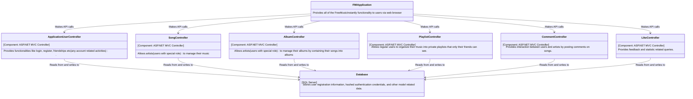

```mermaid

classDiagram

    %% Controllers

    class FMIApplication{
        Proivdes all of the FreeMusicInstantly functionality to users via web browser
    }

    class ApplicationUserController {
        [Component: ASP.NET MVC Controller]
        Provides functionalities like login, register, friendships etc (any account related activities).
    }

    class SongController {
        [Component: ASP.NET MVC Controller]
        Allows artists (users with special role) to manage their music
    }

    class AlbumController {
        [Component: ASP.NET MVC Controller]
        Allows artists (users with special role) to manage their albums by containing their songs into albums
    }

    class PlaylistController {
        [Component: ASP.NET MVC Controller]
        Allows regular users to organize their music into private playlists that only their friends can see.
    }

    class CommentController {
        [Component: ASP.NET MVC Controller]
        Provides interaction between users and artists by posting comments on songs.
    }

    class LikeController {
        [Component: ASP.NET MVC Controller]
        Provides feedback and statistic related queries.
    }

    class Database {
        [SQL Server]
        Stores user registration information, hashed authentication credentials, and other model related data.
    }

    %% Controller relationships

    FMIApplication -->  ApplicationUserController : Makes API calls
    FMIApplication -->  SongController : Makes API calls
    FMIApplication -->  AlbumController : Makes API calls
    FMIApplication -->  PlaylistController : Makes API calls
    FMIApplication -->  CommentController : Makes API calls
    FMIApplication -->  LikeController : Makes API calls

    ApplicationUserController -->  Database  : Reads from and writes to
    SongController -->  Database : Reads from and writes to
    AlbumController -->  Database : Reads from and writes to
    PlaylistController -->  Database : Reads from and writes to
    CommentController -->  Database : Reads from and writes to
    LikeController -->  Database : Reads from and writes to

```
