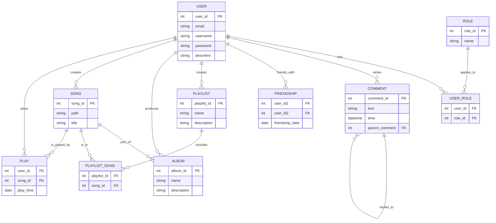

```mermaid
erDiagram
    USER {
        int user_id PK
        string email
        string username
        string password
        string descriere
    }

    ROLE {
        int role_id PK
        string name
    }

    SONG {
        int song_id PK
        string path
        string title
    }

    ALBUM {
        int album_id PK
        string name
        string description
    }

    PLAYLIST {
        int playlist_id PK
        string name
        string description
    }

    PLAY {
        int user_id FK
        int song_id FK
        date play_time
    }

    COMMENT {
        int comment_id PK
        string text
        datetime time
        int parent_comment FK
    }

    PLAYLIST_SONG {
        int playlist_id FK
        int song_id FK
    }

    FRIENDSHIP {
        int user_id1 FK
        int user_id2 FK
        date friendship_date
    }

    USER_ROLE {
        int user_id FK
        int role_id FK
    }

    USER ||--o{ USER_ROLE : has
    ROLE ||--o{ USER_ROLE : applies_to
    USER ||--o{ COMMENT : writes
    SONG ||--o{ ALBUM : part_of
    PLAYLIST ||--o{ PLAYLIST_SONG : includes
    SONG ||--o{ PLAYLIST_SONG : is_in
    COMMENT ||--o{ COMMENT : replies_to
    USER ||--o{ FRIENDSHIP : friends_with
    USER ||--o{ PLAYLIST : creates
    USER ||--o{ ALBUM : produces
    USER ||--o{ SONG : creates
    USER ||--o{ PLAY : plays
    SONG ||--o{ PLAY : is_played_by

```
