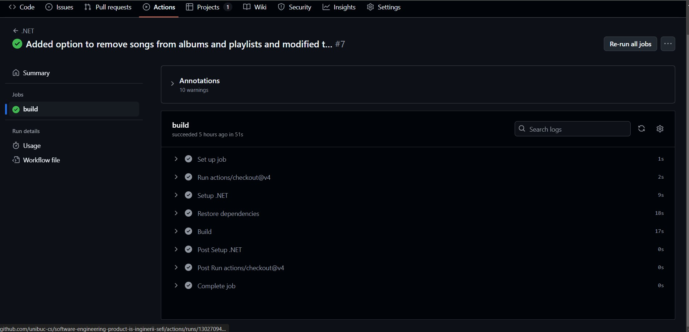
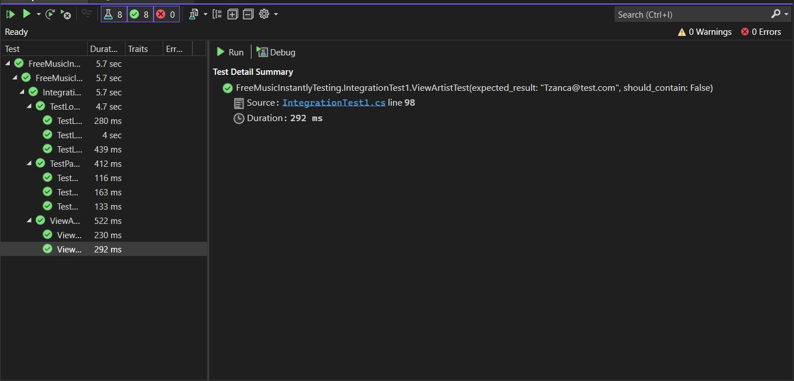
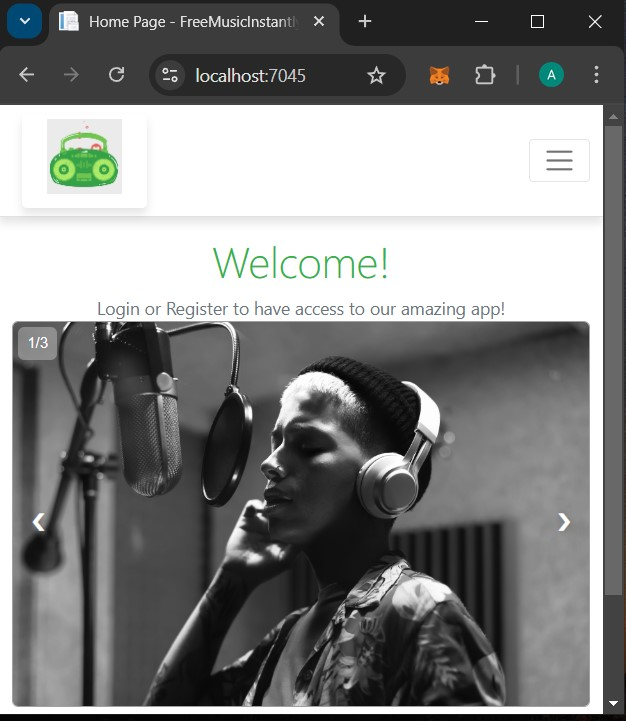
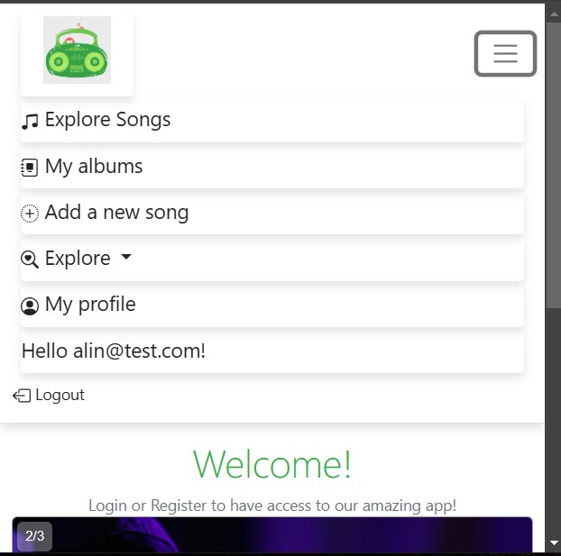
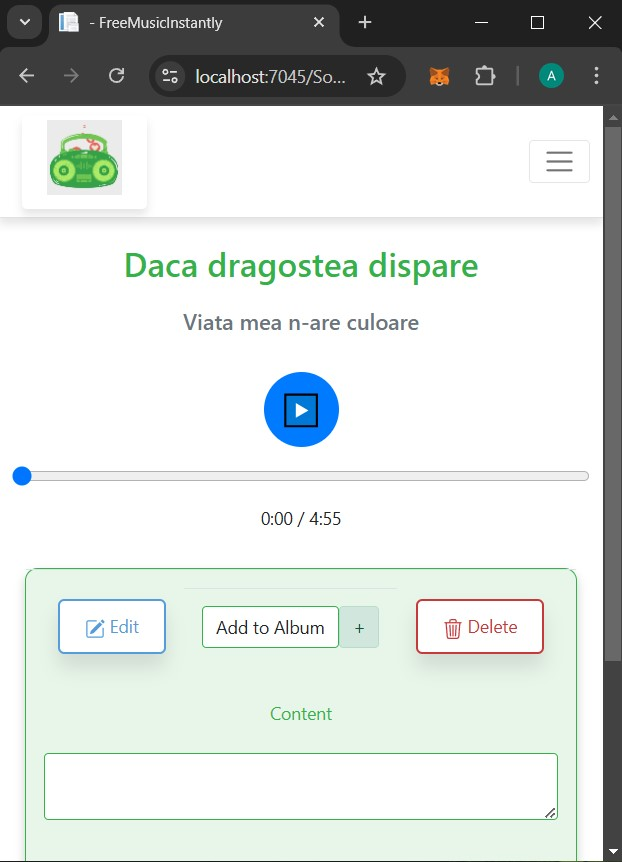

# software-engineering-product-is-inginerii-sefi

## FreeMusicInstantly(FMI)

### Product Vision:

Proiectul nostru, pe nume FreeMusicInstantly(FMI),  este o platforma de streaming de muzica. Exista doua tipuri de utilizatori: ascultator si artist. Aplicatia are in viziune promovarea in mod gratuit pentru artistii 'underground' si subapreciati, iar ascultatorilor le ofera o gama larga de muzica inovativa.

Aplicatia noastra permite ascultatorilor sa-si formeze playlisturi cu muzica de la artistii lor preferati, iar, spre deosbire de Spotify, de exemplu, sa interactioneze atat intre ei, cat si cu artistii, prin intermediul unor comentarii postate pentru piese.

Artistii pot sa-si organizeze piesele incarcate sub forma de albume, cat si sub forma de single-uri. Artistii pot observa prin intermediul platformei noastre diferite metrici despre piesele si albumele lor legate de gradul de apreciere, numarul de ascultari, etc.

Poti sa te imprietenesti cu diferiti utilizatori pentru a impartasi experiente muzicale deosebite. Ca ascultator, poti vizualiza playlist-urile altor ascultatori pentru a vedea ce muzica are in casti un prieten de-al tau ;). Poti cauta muzica, artisti sau albume. Daca nu ai ceva specific in minte, poti sa rasfoiesti catalogul principal oferit de aplicatia noastra.

### CI/CD:

Am decis sa dezvlotam feature-uri pe diferite branch-uri cu nume sugestiv, iar dupa ce acestea au fost testate manual, in urma unui pull request (aprobat de alti colegi), schimbarile facute sa fie merge-uite in main branch.

Pe main branch sta proiectul production ready. Cu ajutorul GitHub Actions am configurat un scurt script care face build proiectului in momentul unui pull request spre Main branch sau in momentul unui push pe Main. Acest lucru urmareste sa nu avem in productie un proiect care nici nu porneste.

### QA

Pe partea de testare, pe langa testare manuala prin care am gasit si semnalat diverse bug-uri, am considerat ca `Integration Tests` sunt cele mai potrivite pentru situatia noastra, profitand de `Seed Data` cu care este populata baza de date.

Obiectivele testarii:

* Testarea ca endpoint-urile raspund corect la request-uri valide

    * Pentru cazul in care user-ul curent nu este logat in aplicatie, am testat pagina de login si home page

    * Pentru un utilizator autentificat, am verificat si paginile care necesita acest lucru

* Testarea ca datele din `Seed Data` sunt valide si incarcate de catre `Controllerele` aferente.

Testarea manuala a fost realizata in majoritatea momentelor dezvoltarii produsului software, cu accentul in momentul unui Pull Request spre Main.

Testarea automata (`Integration Tests`) a fost realizata in faza de implementare spre partea de pre-release. Acest lucru ne-a oferit siguranta ca aplicatia este complet functionala.

Am folosit framework-ul `xunit` care a facilitat scrierea usoara a testelor.

### UX (User Experience)

Un mare focus al nostru a fost mobile user experience, deoarece, in general, aplicatiile online de streaming de muzica sunt folosite pe smartphone-uri. Asa ca, ne-am asigurat ca aplicatia este usor de folosit pe telefon si ca interfata este responsive:

|  |  |  |
|---|---|---|

### [DEMO](https://unibucro0-my.sharepoint.com/:v:/g/personal/daria-maria_pirvulescu_s_unibuc_ro/ESAtHXZpFj1Bp_ZcFBhLdGMB74QGu9CWUiEcaFlAinlXDQ)
