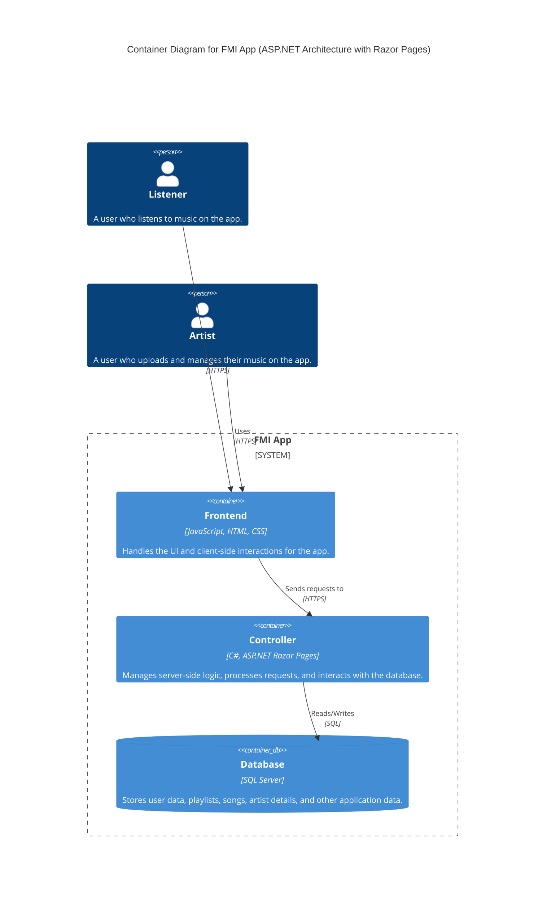

```mermaid 

C4Container
    title Container Diagram for FMI App (ASP.NET Architecture with Razor Pages)

    Person(listener, "Listener", "A user who listens to music on the app.")
    Person(artist, "Artist", "A user who uploads and manages their music on the app.")

    System_Boundary(app, "FMI App") {
        Container(frontend, "Frontend", "JavaScript, HTML, CSS", "Handles the UI and client-side interactions for the app.")
        Container(controller, "Controller", "C#, ASP.NET Razor Pages", "Manages server-side logic, processes requests, and interacts with the database.")
        ContainerDb(database, "Database", "SQL Server", "Stores user data, playlists, songs, artist details, and other application data.")
    }

    Rel(listener, frontend, "Uses", "HTTPS")
    Rel(artist, frontend, "Uses", "HTTPS")
    Rel(frontend, controller, "Sends requests to", "HTTPS")
    Rel(controller, database, "Reads/Writes", "SQL")

    UpdateLayoutConfig($c4ShapeInRow="3", $c4BoundaryInRow="1")
```
