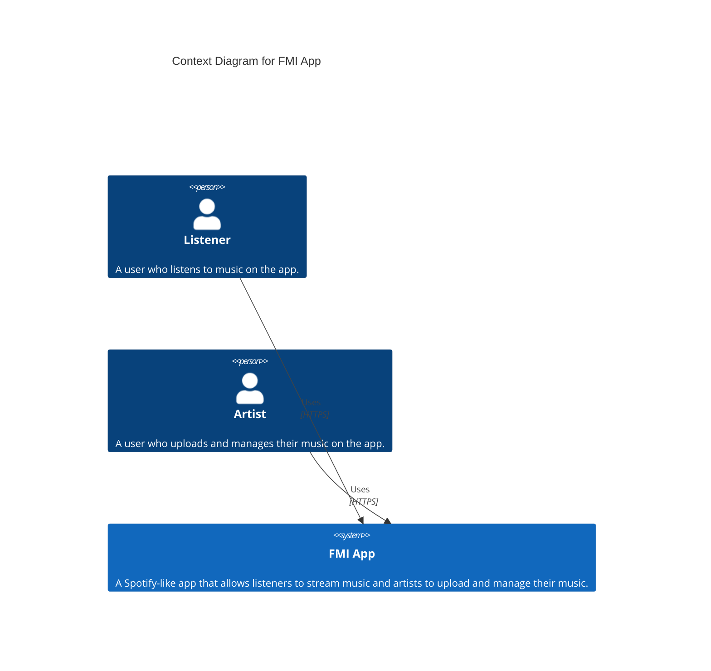

```mermaid
C4Context
    title Context Diagram for FMI App

    Person(listener, "Listener", "A user who listens to music on the app.")
    Person(artist, "Artist", "A user who uploads and manages their music on the app.")

    System(fmi_app, "FMI App", "A Spotify-like app that allows listeners to stream music and artists to upload and manage their music.")

    Rel(listener, fmi_app, "Uses", "HTTPS")
    Rel(artist, fmi_app, "Uses", "HTTPS")

    UpdateLayoutConfig($c4ShapeInRow="2", $c4BoundaryInRow="1")
```
