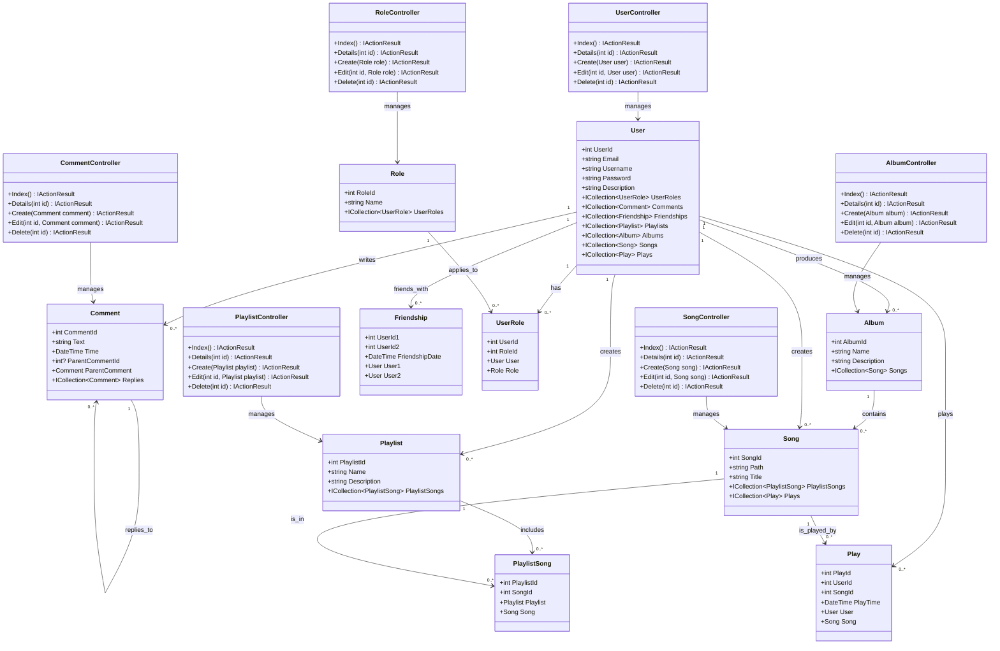

```mermaid
classDiagram
    class User {
        +int UserId
        +string Email
        +string Username
        +string Password
        +string Description
        +ICollection~UserRole~ UserRoles
        +ICollection~Comment~ Comments
        +ICollection~Friendship~ Friendships
        +ICollection~Playlist~ Playlists
        +ICollection~Album~ Albums
        +ICollection~Song~ Songs
        +ICollection~Play~ Plays
    }

    class Role {
        +int RoleId
        +string Name
        +ICollection~UserRole~ UserRoles
    }

    class Song {
        +int SongId
        +string Path
        +string Title
        +ICollection~PlaylistSong~ PlaylistSongs
        +ICollection~Play~ Plays
    }

    class Album {
        +int AlbumId
        +string Name
        +string Description
        +ICollection~Song~ Songs
    }

    class Playlist {
        +int PlaylistId
        +string Name
        +string Description
        +ICollection~PlaylistSong~ PlaylistSongs
       
    }

    class Play {
        +int PlayId
        +int UserId
        +int SongId
        +DateTime PlayTime
        +User User
        +Song Song
    }

    class Comment {
        +int CommentId
        +string Text
        +DateTime Time
        +int? ParentCommentId
        +Comment ParentComment
        +ICollection~Comment~ Replies
    }

    class PlaylistSong {
        +int PlaylistId
        +int SongId
        +Playlist Playlist
        +Song Song
    }

    class Friendship {
        +int UserId1
        +int UserId2
        +DateTime FriendshipDate
        +User User1
        +User User2
    }

    class UserRole {
        +int UserId
        +int RoleId
        +User User
        +Role Role
    }

    %% Controllers
    class UserController {
        +Index() IActionResult
        +Details(int id) IActionResult
        +Create(User user) IActionResult
        +Edit(int id, User user) IActionResult
        +Delete(int id) IActionResult
    }

    class RoleController {
        +Index() IActionResult
        +Details(int id) IActionResult
        +Create(Role role) IActionResult
        +Edit(int id, Role role) IActionResult
        +Delete(int id) IActionResult
    }

    class SongController {
        +Index() IActionResult
        +Details(int id) IActionResult
        +Create(Song song) IActionResult
        +Edit(int id, Song song) IActionResult
        +Delete(int id) IActionResult
    }

    class AlbumController {
        +Index() IActionResult
        +Details(int id) IActionResult
        +Create(Album album) IActionResult
        +Edit(int id, Album album) IActionResult
        +Delete(int id) IActionResult
    }

    class PlaylistController {
        +Index() IActionResult
        +Details(int id) IActionResult
        +Create(Playlist playlist) IActionResult
        +Edit(int id, Playlist playlist) IActionResult
        +Delete(int id) IActionResult
    }

    class CommentController {
        +Index() IActionResult
        +Details(int id) IActionResult
        +Create(Comment comment) IActionResult
        +Edit(int id, Comment comment) IActionResult
        +Delete(int id) IActionResult
    }

    User "1" --> "0..*" UserRole : has
    Role "1" --> "0..*" UserRole : applies_to
    User "1" --> "0..*" Comment : writes
    Comment "1" --> "0..*" Comment : replies_to
    Playlist "1" --> "0..*" PlaylistSong : includes
    Song "1" --> "0..*" PlaylistSong : is_in
    User "1" --> "0..*" Friendship : friends_with
    User "1" --> "0..*" Playlist : creates
    User "1" --> "0..*" Album : produces
    Album "1" --> "0..*" Song : contains
    User "1" --> "0..*" Song : creates
    User "1" --> "0..*" Play : plays
    Song "1" --> "0..*" Play : is_played_by

    %% Controller relationships
    UserController --> User : manages
    RoleController --> Role : manages
    SongController --> Song : manages
    AlbumController --> Album : manages
    PlaylistController --> Playlist : manages
    CommentController --> Comment : manages
```
